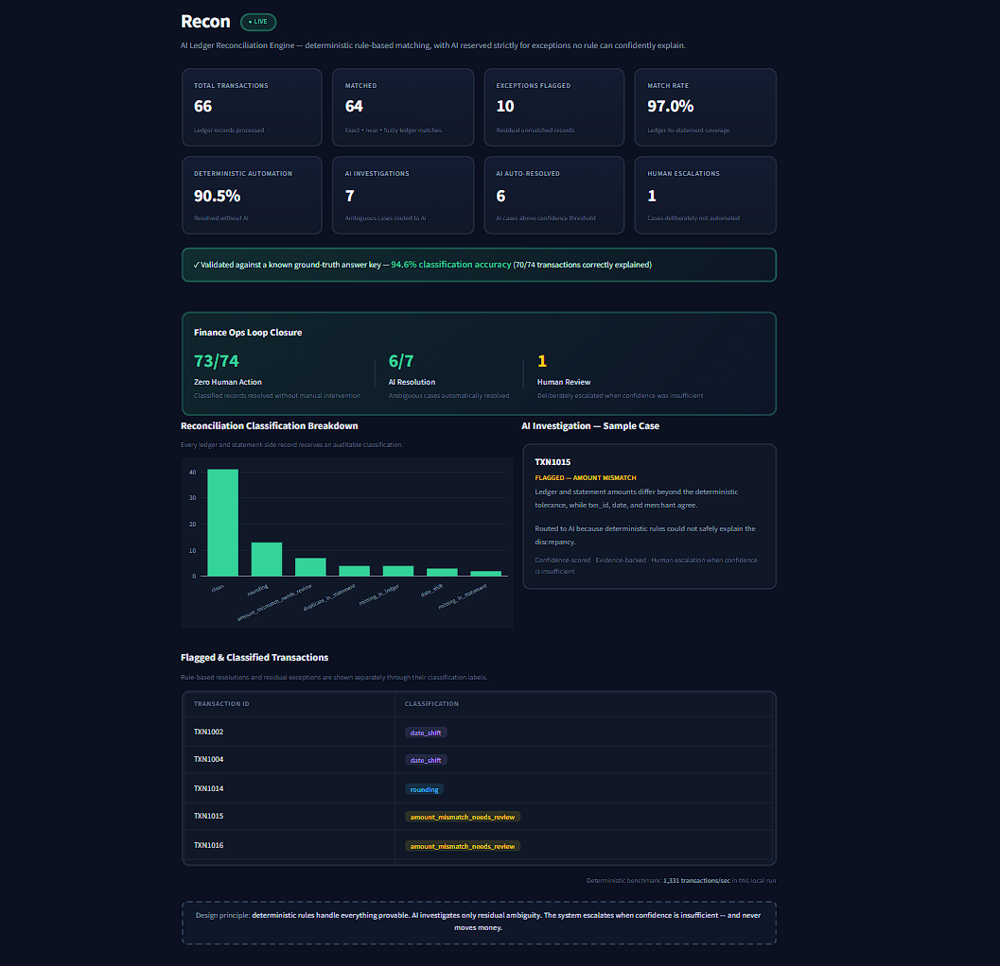

# Recon — AI Ledger Reconciliation Engine

> **A hybrid finance-ops agent that reconciles ledger and bank transactions, proves what can be matched deterministically, investigates ambiguous exceptions with AI, and escalates only what still needs human judgment.**

Recon is an **AI-powered ledger reconciliation engine** built for the **Razorpay AI Buildathon 2026 — Track 04: AI Finance Controller**.

The core idea is simple:

**Don't use AI where rules can prove the answer. Use AI only where deterministic reconciliation runs out.**

---

## 🎯 Problem

Financial reconciliation is still highly manual.

A finance controller may need to compare:

- Internal ledger transactions
- Bank statements
- Transaction IDs
- Amounts
- Dates
- Merchant references
- Duplicate entries
- Missing transactions
- Settlement differences

The difficult part is not identifying obvious matches.

The difficult part is efficiently handling the **exceptions**.

A production-quality reconciliation system therefore needs to:

1. Match obvious transactions automatically.
2. Detect amount/date discrepancies.
3. Identify missing or duplicate transactions.
4. Investigate ambiguous exceptions.
5. Decide when automation is safe.
6. Escalate uncertain cases to a human.
7. Maintain an auditable explanation of every decision.

That's what Recon is designed to demonstrate.

---

# 🚀 What Recon Does

Recon processes transactions through a layered reconciliation pipeline:

```text
                 ┌───────────────────────────┐
                 │     Ledger Transactions    │
                 └─────────────┬─────────────┘
                               │
                               ▼
                 ┌───────────────────────────┐
                 │      Bank Statement        │
                 └─────────────┬─────────────┘
                               │
                               ▼
              ┌────────────────────────────────┐
              │     Deterministic Matching      │
              │                                │
              │  • Exact transaction ID        │
              │  • Amount comparison            │
              │  • Date tolerance               │
              │  • Merchant normalization       │
              │  • Fuzzy matching               │
              └───────────────┬────────────────┘
                              │
                 ┌────────────┴────────────┐
                 │                         │
              Resolved                  Exception
                 │                         │
                 ▼                         ▼
        ┌─────────────────┐      ┌────────────────────┐
        │ Rule-based      │      │ Exception          │
        │ Classification  │      │ Classification     │
        └────────┬────────┘      └──────────┬─────────┘
                 │                          │
                 │                          ▼
                 │                 ┌────────────────────┐
                 │                 │ AI Investigator    │
                 │                 │                    │
                 │                 │ • Context          │
                 │                 │ • Reasoning        │
                 │                 │ • Confidence       │
                 │                 │ • Recommendation   │
                 │                 └─────────┬──────────┘
                 │                           │
                 │              ┌────────────┴────────────┐
                 │              │                         │
                 │         High confidence          Low confidence
                 │              │                         │
                 │              ▼                         ▼
                 │       Auto-resolve             Human review
                 │
                 └──────────────────┬────────────────────┘
                                    │
                                    ▼
                         ┌─────────────────────┐
                         │ Audit JSON +        │
                         │ Streamlit Dashboard │
                         └─────────────────────┘
```

---

# 🧠 Core Design Principle

## Deterministic first. AI second. Human last.

Recon intentionally does **not** send every transaction to an LLM.

Instead:

```text
Can deterministic rules prove the result?
                │
          ┌─────┴─────┐
         YES           NO
          │             │
          ▼             ▼
     Resolve it     Investigate
                    with AI
                       │
                ┌──────┴──────┐
             Confident      Uncertain
                │               │
                ▼               ▼
           Auto-resolve    Human review
```

This gives the system three important properties:

- **High throughput** for routine reconciliation
- **Controlled AI usage** for ambiguous cases
- **Safe escalation** when confidence is insufficient

> **Recon doesn't use AI to guess what can already be proven — it only reaches for a model when deterministic rules run out.**

---

# ✨ Key Features

### 1. Exact Matching

Transactions are first matched using transaction IDs.

This handles the highest-confidence reconciliation cases with minimal computation.

---

### 2. Near-Match Detection

When the transaction ID matches but financial attributes differ, Recon checks:

- Amount
- Transaction date
- Merchant information

Examples:

```text
Ledger amount:    ₹10,000.00
Bank amount:      ₹10,000.50

→ Rounding difference
```

or:

```text
Ledger date:      2026-08-10
Bank date:        2026-08-11

→ Date shift
```

---

### 3. Fuzzy Matching

For transactions where an exact transaction ID is unavailable, Recon can identify candidates using:

- Merchant similarity
- Amount equality/tolerance
- Date tolerance

This helps recover matches that would otherwise appear as missing transactions.

---

### 4. Exception Classification

Transactions are classified into categories such as:

```text
clean
rounding
amount_mismatch_needs_review
duplicate_in_statement
missing_in_ledger
date_shift
missing_in_statement
```

This converts a raw reconciliation output into an actionable exception queue.

---

### 5. AI Exception Investigator

Only ambiguous exceptions are sent to the AI investigator.

The investigator receives transaction context and returns:

- Classification
- Explanation
- Recommendation
- Confidence

Example:

```text
Transaction: TXN1015

Finding:
The bank amount differs slightly from the ledger amount.

Reason:
The difference is consistent with a small rounding adjustment.

Recommendation:
Accept as rounding difference.

Confidence:
0.93

Action:
AUTO-RESOLVE
```

---

### 6. Confidence-Based Routing

AI output is not automatically trusted.

Recon uses a confidence threshold:

```text
Confidence >= 0.85
        │
        ▼
   Auto-resolve


Confidence < 0.85
        │
        ▼
   Human review
```

This creates an explicit safety boundary around AI decisions.

---

### 7. Audit Trail

The pipeline produces a structured reconciliation report containing:

- Matching results
- Classifications
- AI investigations
- Confidence scores
- Recommendations
- Escalations
- Performance metrics

This makes the reconciliation process inspectable rather than a black box.

---

# 📊 Current Benchmark

The current synthetic evaluation contains:

- **66 ledger transactions**
- Additional statement-side records for exception evaluation
- **74 total classified items**

Results from the current pipeline:

| Metric | Result |
|---|---:|
| Ledger transactions | **66** |
| Exact matches | **41** |
| Near matches | **23** |
| Fuzzy matches | **0** |
| Residual unmatched records | **10** |
| Match rate | **97.0%** |
| Classification accuracy | **94.6% (70/74)** |
| Deterministic automation | **90.5% (67/74)** |
| AI investigations | **7** |
| AI auto-resolved | **6** |
| Human escalations | **1** |
| Zero-human-action | **73/74 (98.6%)** |

### Throughput

Local deterministic runs have varied between roughly **500 and 3,000+ transactions/sec** across repeated executions on the same machine.

This variance is itself informative: throughput depends heavily on machine load, Python process startup, and file I/O at the moment of each run, so the benchmark should be treated as an observed local performance range rather than a fixed guaranteed number.

---

# 📐 Understanding the Metrics

The dashboard intentionally separates different populations and metrics.

## Match Rate

```text
(clean + near + fuzzy) / ledger transactions
```

For the current dataset:

```text
(41 + 23 + 0) / 66 = 97.0%
```

This measures how many ledger transactions were covered by a corresponding bank-side record.

**Important:** a near match can still represent an exception because its amount/date may differ.

---

## Classification Accuracy

The classifier evaluates:

```text
74 classified items
```

This includes:

```text
66 ledger transactions
+
8 statement-only records
=
74 classified items
```

Current result:

```text
70 correct / 74 scored = 94.6%
```

The scoring also treats a safe `_needs_review` prediction as correct when the ground truth explicitly identifies the case as `ambiguous_amount`.

This reflects an important finance principle:

> **Escalating an uncertain transaction can be the correct behavior.**

---

## Deterministic Automation Rate

```text
67 / 74 = 90.5%
```

This measures the portion of classified items resolved without requiring the AI investigator.

---

## AI Investigation

The current dataset sends:

```text
7 ambiguous cases
```

to the AI investigator.

Of these:

```text
6 → auto-resolved
1 → human escalation
```

---

## Zero-Human-Action Rate

The complete loop closes automatically for:

```text
73 / 74 = 98.6%
```

This metric is intentionally different from deterministic automation because some cases are resolved by the AI investigator after deterministic rules have exhausted their options.

---

# 🔐 Ground-Truth Evaluation

The project includes:

```text
data/ground_truth.csv
```

as a separate evaluation answer key.

The important distinction is:

**The reconciliation engine does not use the ground truth to make its predictions.**

The classification functions:

```text
classify_near_match()
classify_unmatched()
```

do not read `ground_truth.csv`.

The ground-truth file is loaded **only afterward** by:

```text
score_against_ground_truth()
```

to evaluate the engine's output.

In other words:

```text
Ledger + Bank Statement
        │
        ▼
   Reconciliation
        │
        ▼
   Predictions
        │
        ├──────────────► Ground Truth
        │                    │
        ▼                    ▼
   Evaluation          Accuracy Metrics
```

This keeps prediction and evaluation logically separated.

---

# 🤖 AI Architecture

Recon uses a **bounded AI investigator**, not an LLM-driven reconciliation engine.

The AI is only called after deterministic processing identifies an ambiguous case.

### AI flow

```text
Exception
   │
   ▼
Prepare transaction context
   │
   ▼
Send to LLM
   │
   ▼
Structured response
   │
   ├── classification
   ├── reasoning
   ├── recommendation
   └── confidence
   │
   ▼
Validate response
   │
   ▼
Confidence routing
   │
   ├── >= 0.85 → Auto-resolve
   │
   └── < 0.85  → Human review
```

---

# 🛡️ AI Safety Boundary

The model does **not** directly modify transactions.

It cannot:

- Move money
- Edit the ledger
- Initiate refunds
- Initiate settlements
- Approve payments
- Delete financial records

The AI only produces an investigation result and recommendation.

The system then applies a deterministic confidence policy.

> **The model can recommend. It cannot move money.**

This separation is intentional.

---

# 🧩 Technology Stack

| Component | Technology |
|---|---|
| Language | Python |
| Data processing | Pandas |
| Reconciliation | Custom Python rules |
| Fuzzy matching | Python / similarity logic |
| AI investigator | Groq API |
| AI model | `openai/gpt-oss-20b` |
| Dashboard | Streamlit |
| Visualization | Plotly |
| Data format | CSV / JSON |
| Version control | Git / GitHub |

---

# 📁 Project Structure

```text
recon/
│
├── data/
│   ├── bank_statement.csv
│   ├── ground_truth.csv
│   ├── internal_ledger.csv
│   └── reconciliation_report.json
│
├── src/
│   ├── dashboard.py
│   ├── generate_data.py
│   ├── investigate.py
│   ├── llm_investigator.py
│   └── reconcile.py
│
├── .gitignore
├── README.md
└── requirements.txt
```

---

# ⚙️ How the Pipeline Works

## Step 1 — Load the data

Recon loads:

```text
Internal Ledger
      +
Bank Statement
```

---

## Step 2 — Normalize

Fields such as:

- Transaction IDs
- Merchant names
- Dates
- Amounts

are normalized before comparison.

---

## Step 3 — Exact reconciliation

The engine first attempts high-confidence transaction ID matching.

```text
transaction_id
       │
       ▼
Exact match?
   │       │
  YES      NO
   │       │
   ▼       ▼
Continue  Fuzzy matching
```

---

## Step 4 — Compare attributes

For matched transaction IDs, Recon checks:

```text
Amount
Date
Merchant
```

Differences are classified into known exception types.

---

## Step 5 — Fuzzy matching

If an exact ID match is unavailable, Recon attempts candidate matching using transaction attributes.

---

## Step 6 — Rule-based classification

Known patterns are resolved without AI.

Examples:

```text
Small amount difference
        ↓
Rounding

Date outside normal date
        ↓
Date shift

Duplicate transaction
        ↓
Duplicate in statement
```

---

## Step 7 — AI investigation

Only unresolved ambiguous cases are sent to the LLM.

---

## Step 8 — Confidence routing

```text
AI confidence >= 0.85
        ↓
Auto-resolve

AI confidence < 0.85
        ↓
Human review
```

---

## Step 9 — Audit report

The pipeline writes:

```text
data/reconciliation_report.json
```

which powers the dashboard and preserves the reconciliation results.

---

# 🖥️ Dashboard


Recon includes a Streamlit dashboard for finance-controller-style monitoring.

The dashboard provides:

### Executive KPIs

- Total transactions
- Matched transactions
- Exceptions flagged
- Match rate
- Deterministic automation
- AI investigations
- AI auto-resolutions
- Human escalations

### Validation

- Ground-truth accuracy
- Correct predictions
- Scored items

### Loop Closure

Shows how the entire exception workflow was resolved:

```text
74 classified items
        │
        ├── 67 deterministic
        ├── 6 AI auto-resolved
        └── 1 human escalation
```

Result:

```text
73 / 74
98.6% zero-human-action
```

### Exception Analysis

The dashboard also displays the distribution of classifications, individual transaction decisions, AI reasoning, and processing throughput.

---

# ▶️ Running the Project

## 1. Clone the repository

```bash
git clone https://github.com/khindimegha-hub/recon.git
cd recon
```

---

## 2. Create a virtual environment

### Windows

```powershell
python -m venv .venv
.venv\Scripts\activate
```

### macOS / Linux

```bash
python3 -m venv .venv
source .venv/bin/activate
```

---

## 3. Install dependencies

```bash
pip install -r requirements.txt
```

---

# 🔑 Configure the AI API

Recon uses the Groq API for ambiguous exception investigation.

Set your API key as an environment variable.

### Windows PowerShell

```powershell
$env:GROQ_API_KEY="your_api_key_here"
```

### Windows CMD

```cmd
set GROQ_API_KEY=your_api_key_here
```

### macOS / Linux

```bash
export GROQ_API_KEY="your_api_key_here"
```

Do **not** commit your API key to GitHub.

---

# 🧪 Run Reconciliation

Run the deterministic reconciliation engine:

```bash
python src/reconcile.py
```

This produces metrics for:

- Matching
- Classification
- Accuracy
- Automation
- Throughput

---

# 🤖 Run the Full Investigation Loop

Run the complete reconciliation + AI investigation pipeline:

```bash
python src/investigate.py
```

This performs:

```text
Reconciliation
      ↓
Exception detection
      ↓
Ambiguous-case routing
      ↓
AI investigation
      ↓
Confidence evaluation
      ↓
Auto-resolution / human escalation
      ↓
Audit report
```

The resulting report is written to:

```text
data/reconciliation_report.json
```

---

# 📊 Launch the Dashboard

Run:

```bash
streamlit run src/dashboard.py
```

Then open the local Streamlit URL shown in the terminal.

---

# 🔄 Complete Demo Flow

For the complete demonstration, run:

```bash
python src/reconcile.py
python src/investigate.py
streamlit run src/dashboard.py
```

Recommended demo sequence:

```text
1. Run reconciliation
        ↓
2. Show deterministic matching
        ↓
3. Show exception classification
        ↓
4. Run AI investigation
        ↓
5. Show confidence-based routing
        ↓
6. Show 6 AI auto-resolutions
        ↓
7. Show 1 human escalation
        ↓
8. Open dashboard
        ↓
9. Show audit report and metrics
```

---

# 📈 Why This Approach Scales Better Than "LLM Everything"

A naive AI reconciliation system could send every transaction to an LLM:

```text
66 transactions
      ↓
66 LLM calls
      ↓
Higher cost
Higher latency
Less predictable behavior
```

Recon instead does:

```text
66 transactions
      ↓
Deterministic reconciliation
      ↓
Known cases resolved cheaply
      ↓
Only ambiguous cases → AI
      ↓
7 AI investigations
```

For this dataset:

```text
74 classified items
67 deterministic resolutions
7 AI investigations
```

That means the AI layer is focused on the part of the workflow where reasoning actually adds value.

---

# 💡 Why Hybrid AI?

Financial systems require more than high accuracy.

They also need:

- Explainability
- Predictability
- Auditability
- Low latency
- Controlled failure modes
- Human oversight

Deterministic rules are excellent for known patterns.

LLMs are useful for ambiguous context.

Humans remain the final authority when the system is uncertain.

Therefore:

```text
Rules → Known problems
AI → Ambiguous problems
Human → Uncertain problems
```

This is the central architecture behind Recon.

---

# 🏦 Finance-Controller Perspective

Recon is designed around the workflow of a finance controller rather than around an AI demo.

Instead of asking:

> "Can an LLM classify transactions?"

the system asks:

> "How much of the reconciliation loop can be safely closed without human intervention?"

That changes the success metric.

The important numbers become:

```text
Match coverage
      +
Automation rate
      +
AI resolution rate
      +
Human escalation rate
      +
Auditability
```

The current pipeline demonstrates:

```text
97.0% ledger match coverage

90.5% deterministic automation

6/7 AI cases auto-resolved

1/7 AI cases escalated

98.6% zero-human-action loop closure
```

---

# 🧠 Engineering Decisions

## Why not use the ground truth during reconciliation?

Because that would leak evaluation information into the prediction pipeline.

The engine makes its decisions from:

```text
Ledger
+
Bank statement
+
Reconciliation rules
+
AI investigation
```

Ground truth is consulted only after predictions have been generated.

---

## Why not send every transaction to AI?

Because deterministic rules are:

- Faster
- Cheaper
- More predictable
- Easier to audit

The LLM is reserved for ambiguity.

---

## Why use confidence thresholds?

A model's recommendation should not automatically become a financial action.

Confidence creates a controlled boundary:

```text
High confidence
      ↓
Automation

Low confidence
      ↓
Human review
```

---

## Why keep human escalation?

Because uncertainty is a valid system outcome.

A finance automation system should not force a decision when evidence is insufficient.

A good reconciliation engine should be able to say:

> **"I don't know — please review this."**

---

# 🐛 Engineering Challenges & What Broke

Building the pipeline exposed several practical engineering problems.

## 1. JSON serialization of Pandas timestamps

Pandas timestamps are not directly JSON serializable.

The reconciliation report initially failed when writing timestamp values into JSON.

The solution was to normalize timestamp values before serialization.

---

## 2. AI API credit limitations

The initial AI integration used an API configuration that could not complete requests because of account credit limitations.

The AI layer was moved to Groq so the project could continue using a compatible API-based LLM workflow.

---

## 3. Model availability

Rather than assuming a model name was available, the available model list was queried and the integration was updated to use:

```text
openai/gpt-oss-20b
```

This made the integration depend on an actually available model rather than a guessed identifier.

---

## 4. Dashboard rendering

The first dashboard implementation used `st.bar_chart` and `st.dataframe` with a custom dark theme applied via a `.streamlit/config.toml` file — but the chart and table kept rendering with a white background regardless. Rather than spend further time diagnosing exactly why Streamlit's theme config wasn't propagating to those specific native components, the dashboard was rebuilt using Plotly (for the chart) and hand-written HTML (for the table), with every color set explicitly in code. This removes the dependency on framework theme inheritance working as documented, at the cost of writing more styling code directly.

---

## 5. Metric denominator mismatch

During dashboard development, different metrics accidentally used different populations.

For example:

```text
66 ledger transactions
```

and:

```text
74 classified items
```

represent different denominators.

The dashboard was corrected so that each metric explicitly describes its population.

This is especially important for finance analytics because a mathematically correct number can still be misleading if the denominator is unclear.

---

## 6. Loop-closure population

The final loop closure metric includes:

```text
66 ledger transactions
+
8 statement-only records
=
74 classified items
```

Therefore:

```text
73 / 74
```

is the correct zero-human-action rate.

This distinction prevents incorrectly reporting something like:

```text
73 / 66
```

which would mix two different populations.

---

## 7. Dashboard silently displaying inverted AI routing numbers

The most serious bug found in this project. `investigate.py` writes its audit report as flat top-level JSON keys (`ai_auto_resolved_count`, `escalated_to_human_count`). The dashboard's parsing code, however, looked for a *nested* dictionary under `loop_closure_summary` or `summary`, using different key names entirely. Since that nested structure never existed in the real file, the lookup always silently failed and fell back to a default assumption — one that always displayed zero human escalations, regardless of what actually happened during the AI investigation.

This was caught by directly comparing the dashboard's displayed values against `investigate.py`'s own terminal output for the same run, rather than trusting that a dashboard showing plausible-looking numbers meant the numbers were correct. Fixed by reading the report's actual flat structure directly, with no nested-key guessing.

This is the one bug on this list that would not have caused a crash or an obviously wrong number — a dashboard confidently showing "0 escalations" looks correct at a glance. It's a reminder that a value passing a sanity check (is it a plausible number?) is not the same as it passing a correctness check (does it match the source of truth?).

---

# ⚠️ Known Limitations

Recon is a buildathon-scale prototype, not a production banking system.

### 1. Synthetic dataset

The current evaluation uses synthetic transaction data.

Real financial systems would require much larger and more diverse datasets.

---

### 2. Limited AI context

The AI investigator currently receives a constrained transaction context.

A production implementation could incorporate:

- Historical transactions
- Merchant profiles
- Fee schedules
- Settlement batches
- Payment gateway metadata
- Bank-specific rules
- Previous reconciliation decisions

---

### 3. Fuzzy matching strategy

The current fuzzy matcher uses a greedy first-valid-match strategy.

A production implementation should use globally optimized candidate assignment to reduce the risk of suboptimal matches when multiple transactions are similar.

---

### 4. Confidence calibration

The current confidence threshold:

```text
0.85
```

is a prototype policy rather than a statistically calibrated probability.

A production system should calibrate confidence using historical labeled reconciliation outcomes.

---

### 5. AI retry and recovery

The prototype does not yet implement a sophisticated retry strategy for failed AI calls.

A production system should handle:

- Rate limits
- Timeouts
- Invalid model responses
- API failures
- Malformed JSON
- Temporary service outages

---

### 6. Limited test coverage

The current repository does not yet contain a comprehensive automated test suite or CI pipeline.

Production deployment would require tests for:

- Exact matching
- Fuzzy matching
- Duplicate detection
- Date tolerance
- Amount tolerance
- Classification
- AI response validation
- Confidence routing
- Report generation

---

# 🔮 Future Improvements

A production-grade version of Recon could add:

### Data & reconciliation

- PostgreSQL-backed transaction storage
- Large-scale batch processing
- Globally optimized fuzzy matching
- Multi-bank adapters
- Settlement reconciliation
- Payment gateway reconciliation
- Fee reconciliation

### AI

- Retrieval from historical reconciliation decisions
- Merchant-specific context
- Tool-using investigation agents
- Confidence calibration
- Model fallback
- Structured output validation
- Human feedback loops

### Operations

- Role-based access control
- Authentication
- Approval workflows
- Full audit logging
- Alerting
- Scheduled reconciliation
- Background job processing

### Infrastructure

- Docker
- REST API
- Celery / task queues
- PostgreSQL
- Redis
- CI/CD
- Cloud deployment
- Observability

---

# 🏆 Buildathon Alignment

Recon is designed around the core requirements of an AI finance-controller workflow.

### Multi-source reconciliation

```text
Internal ledger
       +
Bank statement
       ↓
Reconciliation engine
```

### Measured performance

The system reports:

```text
Match rate
Classification accuracy
Automation rate
AI resolution
Human escalation
Throughput
```

### Exception handling

Instead of pretending every transaction can be automatically resolved, Recon exposes unresolved and escalated cases.

### AI where it matters

The LLM is intentionally limited to ambiguous exceptions rather than being used as the primary reconciliation mechanism.

### Human-in-the-loop

Low-confidence AI results are escalated instead of being silently accepted.

### Auditability

Every reconciliation decision can be traced through the generated report.

---

# 🎯 What Makes Recon Different

The interesting part of Recon is not simply:

> "It uses AI."

The important part is the **division of responsibility**.

```text
                 RECON
                   │
       ┌───────────┴───────────┐
       │                       │
 Deterministic              AI
    Engine               Investigator
       │                       │
 Known patterns           Ambiguous cases
       │                       │
       └───────────┬───────────┘
                   │
                   ▼
             Confidence
                Router
                   │
          ┌────────┴────────┐
          │                 │
     Auto-resolve       Human review
```

The system is designed to maximize automation **without pretending uncertainty does not exist**.

---

# 📌 One-Line Summary

> **Recon is a hybrid AI ledger reconciliation engine that uses deterministic matching for routine transactions, AI investigation for ambiguous exceptions, and confidence-based human escalation to close the finance reconciliation loop safely.**

---

# 🔗 Repository

GitHub:

https://github.com/khindimegha-hub/recon

---

# 👩‍💻 Running the Demo

```bash
# Install dependencies
pip install -r requirements.txt

# Run deterministic reconciliation
python src/reconcile.py

# Run AI investigation + loop closure
python src/investigate.py

# Launch dashboard
streamlit run src/dashboard.py
```

---

# 📜 License

This project was created as a prototype for the Razorpay AI Buildathon 2026.
